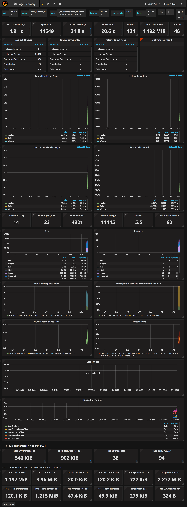

# Automated performance project

This was a demo for FC in 2017
Main objective is to get a client performance monitoring tool up & running

## Why SiteSpeedIO?

I've decided to check SiteSpeedIO because it seems the most stable and open source tool in the market
I'll be using docker since is the most simple way to set up the whole project.

NOTE: we are not using volumes for the experiment. But some images will require it for a production stage


## Network

We will set up a bunch of servers in order to have our project up & running
So, in order to communicate them we need a custom network to isolate them from other containers

```
docker network create --driver bridge performance
```

## Database

SiteSpeedIO uses graphite as TSDB an influx implementation is in progress but not ready


```
docker run -d --name graphite --network=performance \
-p 8080:80 -p 2003:2003 \
sitespeedio/graphite:0.9.14
```

Keep in mind that the default retention/aggregation is 10m for first 2 months 30m for 3 months.
Data is erased after 3 months

## Dashboard

For Dashboard we will use Graphana since sitespeedio provides a set of very nice dashboards

```
docker create --name grafana --network=performance \
-p 3000:3000 \
-e GF_SECURITY_ADMIN_PASSWORD=superpassword \
-e GF_SECURITY_ADMIN_USER=notanadmin \
-e GF_AUTH_ANONYMOUS_ENABLED=true \
-e GF_USERS_ALLOW_SIGN_UP=false \
-e GF_USERS_ALLOW_ORG_CREATE=false \
grafana/grafana:4.1.1
```

We need to connect grafana to the bridge network to have access to it.

```
docker network connect bridge grafana
docker start grafana
```

Load the pre-configured dashboards

```
docker run --rm --network=performance \
-e GF_API=http://grafana:3000/api \
-e GF_PASSWORD=superpassword \
-e GF_USER=notanadmin \
sitespeedio/grafana-bootstrap:grafana-4.1.1-4
```

## Statistics gathering

In order to gather statistics we will run sitespeedio every ~5m

```
docker run --rm --network=performance \
--privileged --shm-size=1g \
sitespeedio/sitespeed.io:4.5.1 \
-n 3 -b chrome --speedIndex \
--firstParty ".fotocasa.es|.inmofactory.com" \
--graphite.host graphite \
--graphite.port 2003 \
--graphite.auth "guest:guest" \
--graphite.httpPort 8080 \
http://www.fotocasa.es/es/ \
http://www.fotocasa.es/es/comprar/casas/barcelona-capital/todas-las-zonas/l
http://www.fotocasa.es/vivienda/la-lastrilla/calefaccion-parking-obispo-antonio-palenzuela-6-135324345
```

NOTE: Api keys here are for demo, please create your own for production usage.

Or set a cron job to gather statistic every 10m

```
## Sitespeed.io demo
*/10 * * * * docker run ...
```

### Google Page Insights

Add

```
--gpsi.key <gpsi-key> \
```

I didn't get any metric from GPSI in the tests.

### WebPageTest

Add

```
--webpagetest.key "<webpagetest-key>" \
```


### 3g Statistics

For 3g network you need to use TC. Since TC is not available in BSD I'll keep this test for AWS
See: https://www.sitespeed.io/documentation/sitespeed.io/browsers/

### API Credentials

Given Keys in this repo are for demo purposes. Please create your own credentials

GPSI: https://console.developers.google.com/apis/credentials
WebPageTest: https://www.webpagetest.org/getkey.php

### Result dashboard




## TODO

- check 3g network - Check in AWS since TC is not in BSD
